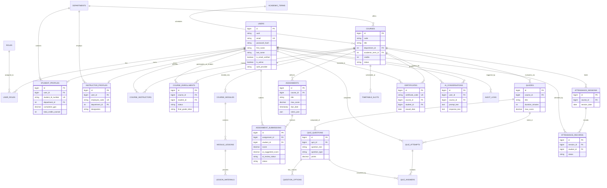

# Entity Relationship Diagram (ERD)
## Opt-Out University Learning Management System (LMS)

```mermaid
erDiagram
    USERS ||--o{ USER_ROLES : "has"
    ROLES ||--o{ USER_ROLES : "assigned_to"
    USERS ||--o| STUDENT_PROFILES : "owns"
    USERS ||--o| INSTRUCTOR_PROFILES : "owns"
    
    DEPARTMENTS ||--o{ STUDENT_PROFILES : "contains"
    DEPARTMENTS ||--o{ INSTRUCTOR_PROFILES : "employs"
    DEPARTMENTS ||--o{ COURSES : "offers"
    ACADEMIC_TERMS ||--o{ COURSES : "schedules"

    COURSES ||--o{ COURSE_INSTRUCTORS : "managed_by"
    USERS ||--o{ COURSE_INSTRUCTORS : "teaches"
    
    COURSES ||--o{ COURSE_ENROLLMENTS : "has_enrolled"
    USERS ||--o{ COURSE_ENROLLMENTS : "participates_as_student"
    
    COURSES ||--o{ COURSE_MODULES : "divided_into"
    COURSE_MODULES ||--o{ MODULE_LESSONS : "contains"
    MODULE_LESSONS ||--o{ LESSON_MATERIALS : "provides"

    COURSES ||--o{ ASSIGNMENTS : "delivers"
    ASSIGNMENTS ||--o{ ASSIGNMENT_SUBMISSIONS : "receives"
    USERS ||--o{ ASSIGNMENT_SUBMISSIONS : "submits"
    
    COURSES ||--o{ QUIZZES : "evaluates_via"
    QUIZZES ||--o{ QUIZ_QUESTIONS : "composed_of"
    QUIZ_QUESTIONS ||--o{ QUESTION_OPTIONS : "has_choices"
    QUIZZES ||--o{ QUIZ_ATTEMPTS : "taken_in"
    USERS ||--o{ QUIZ_ATTEMPTS : "completes"
    QUIZ_ATTEMPTS ||--o{ QUIZ_ANSWERS : "contains"
    QUIZ_QUESTIONS ||--o{ QUIZ_ANSWERS : "answered_by"

    COURSES ||--o{ ATTENDANCE_SESSIONS : "holds"
    ATTENDANCE_SESSIONS ||--o{ ATTENDANCE_RECORDS : "records"
    USERS ||--o{ ATTENDANCE_RECORDS : "attended_by"
    
    COURSES ||--o{ TIMETABLE_SLOTS : "scheduled_at"
    COURSES ||--o{ CERTIFICATES : "grants"
    USERS ||--o{ CERTIFICATES : "awarded_to"
    
    USERS ||--o{ AI_CONVERSATIONS : "queries"
    COURSES ||--o{ AI_CONVERSATIONS : "context_for"
    USERS ||--o{ AUDIT_LOGS : "triggered_by"

    USERS {
        bigint id PK
        string uuid
        string email UK
        string password_hash
        string first_name
        string last_name
        boolean is_email_verified
        boolean is_active
        string auth_provider
    }

    STUDENT_PROFILES {
        bigint id PK
        bigint user_id FK
        string student_id_number UK
        int department_id FK
        decimal cumulative_gpa
        int total_credits_earned
    }

    INSTRUCTOR_PROFILES {
        bigint id PK
        bigint user_id FK
        string employee_code UK
        int department_id FK
        string designation
    }

    COURSES {
        bigint id PK
        string code
        string title
        int department_id FK
        int academic_term_id FK
        int credits
        string status
    }

    COURSE_ENROLLMENTS {
        bigint id PK
        bigint course_id FK
        bigint student_id FK
        string status
        string final_grade_letter
    }

    ASSIGNMENTS {
        bigint id PK
        bigint course_id FK
        string title
        decimal max_score
        timestamp due_date
        json rubric_json
    }

    ASSIGNMENT_SUBMISSIONS {
        bigint id PK
        bigint assignment_id FK
        bigint student_id FK
        decimal score
        decimal ai_suggested_score
        string ai_review_status
        string status
    }

    QUIZZES {
        bigint id PK
        bigint course_id FK
        string title
        int duration_minutes
        decimal max_score
    }

    QUIZ_QUESTIONS {
        bigint id PK
        bigint quiz_id FK
        string question_text
        string question_type
        decimal points
    }

    ATTENDANCE_SESSIONS {
        bigint id PK
        bigint course_id FK
        date session_date
    }

    ATTENDANCE_RECORDS {
        bigint id PK
        bigint session_id FK
        bigint student_id FK
        string status
    }

    CERTIFICATES {
        bigint id PK
        string certificate_code UK
        bigint course_id FK
        bigint student_id FK
        date issued_date
    }

    AI_CONVERSATIONS {
        bigint id PK
        bigint user_id FK
        bigint course_id FK
        text prompt_text
        text response_text
    }
```
